# Self-Service Digital Assistant — Amazon Lex + Bedrock Knowledge Base

> **Lab sandbox (students):** launch your hands-on AWS environment here —
> <https://prod.cloudkida.com/viewlab/CKLAWS-2d9857aaeb8546df838ac74cff264029>

A hands-on project that builds a chatbot which answers questions from your own
documents. It uses **Amazon Lex** (conversational interface) connected to an
**Amazon Bedrock Knowledge Base** (RAG), and serves a custom chat UI from a
single **EC2** instance — no Cognito required.

> **Note on Knowledge Base type:** Amazon Lex `QnAIntent` only works with a
> **VECTOR** knowledge base. A **MANAGED** knowledge base will NOT work.
> When creating the Knowledge Base, be sure to choose the Vector Store option.

---

## Architecture

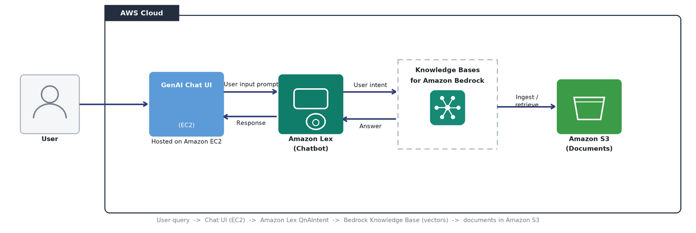

---

## Project Parts

The project is split into parts. Complete them in order.

| Part | Title |
|------|-------|
| 1 | Create and Test the Lex Bot |
| 2 | Upload documents to S3 and create the Bedrock Knowledge Base (VECTOR) |
| 3 | Add the QnAIntent and connect the Knowledge Base |
| 4 | Deploy the chat UI (EC2 + IAM role) |
| 5 | Clean up |

---

## Prerequisites

- An AWS account with permissions for Lex, Bedrock, S3, EC2, and IAM.
- Bedrock **model access** enabled for an embeddings model and a text model
  (e.g. Amazon Titan Embeddings + Amazon Nova / Anthropic Claude).
- A data source in **Amazon S3** (the documents your bot will answer from).
- Region used throughout this guide: **us-east-1**.

---

# Part 1 — Create and Test the Lex Bot

In this part you create the Lex bot, configure a simple greeting intent, build
it, and confirm it responds in the test window.

## 1.1 Create the Amazon Lex bot

Open the Lex console → **Create bot**:

<https://us-east-1.console.aws.amazon.com/lexv2/home?region=us-east-1#createBot>

**Configure bot settings**

1. **Creation method:** select **Traditional → Create a blank bot**.
2. **Bot name:** enter `chatbot`.
3. **IAM permissions:** choose **Create a new IAM role with basic Amazon Lex permissions**.

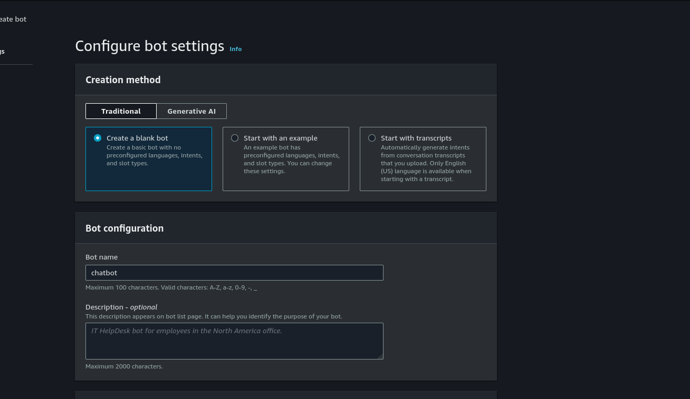

4. Leave the rest of the page at its defaults:
   - **Bot error logging:** Disabled
   - **COPPA:** No
   - **Idle session timeout:** 5 minutes
5. Choose **Next**.

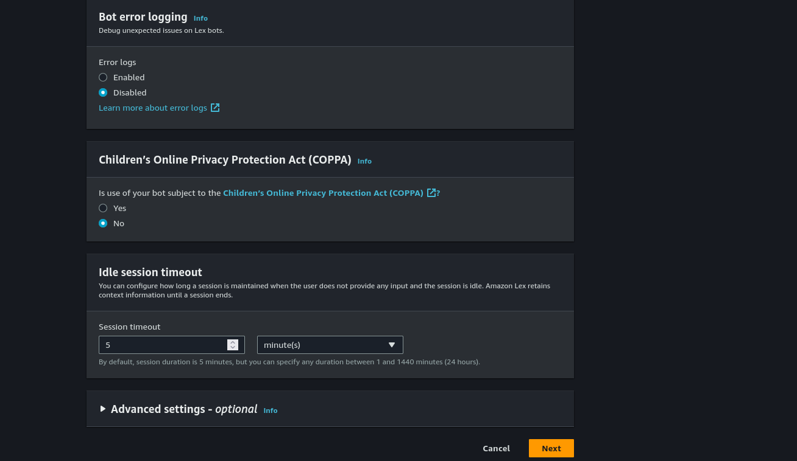

**Add language to bot**

6. **Select language:** **English (US)**.
7. Leave all defaults:
   - Voice interaction: **None. This is only a text based application**
   - Intent classification confidence score threshold: **0.40**
   - Assisted NLU: **Disable**
8. Click **Done**.

The bot is created and you are taken to the intent editor.

## 1.2 Fill in intent details

When the bot is created you land on the default intent (`NewIntent`). Under
**Intent details**:

- **Intent name:** `WelcomeIntent`
- **Display name:** `Greeting`
- **Intent description:** `Handles standard user greetings such as hello, hi, hey, or good morning to initiate the conversation.`

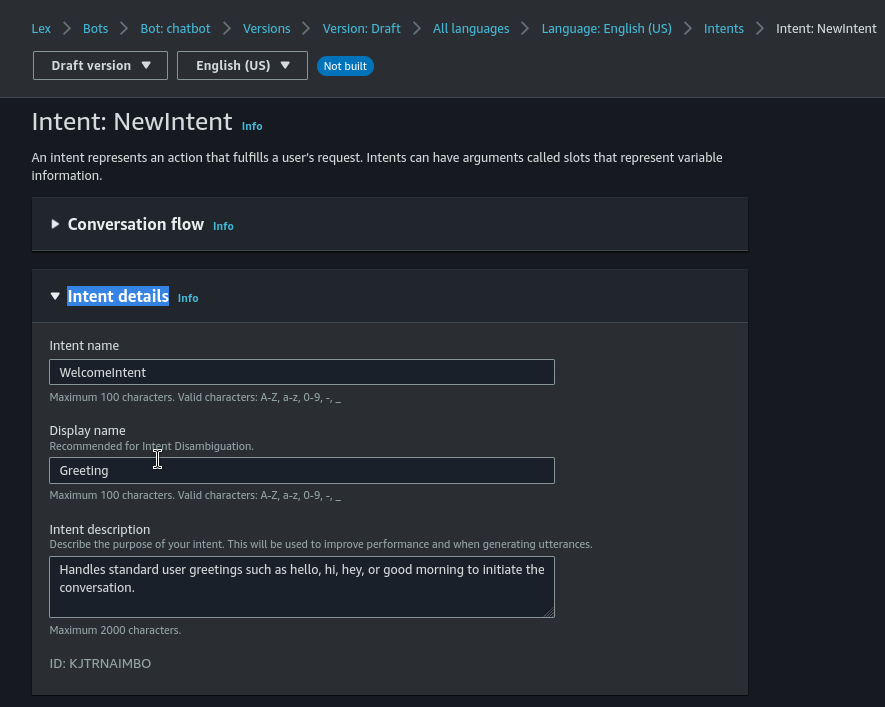

## 1.3 Add sample utterances

Scroll to **Sample utterances** and add the phrases a user might type to trigger
this intent. Type each in the box and choose **Add utterance**:

- `Hello`
- `hello`
- `hii`

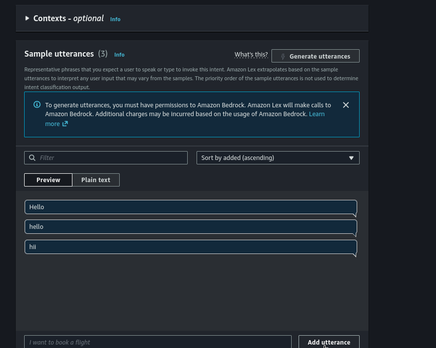

## 1.4 Add an initial response

Scroll to **Initial response** → **Response to acknowledge the user's request**.
In the **Message** box enter the greeting, and optionally add variations:

- **Message:** `Hello, Welcome to Cloudkida Bot !!`
- **Variations (optional):**
  - `Thank you for visiting the Cloudkida Bot. How may I assist you today?`
  - `Greetings! Welcome to the Cloudkida Bot.`

Choose **Save intent**.

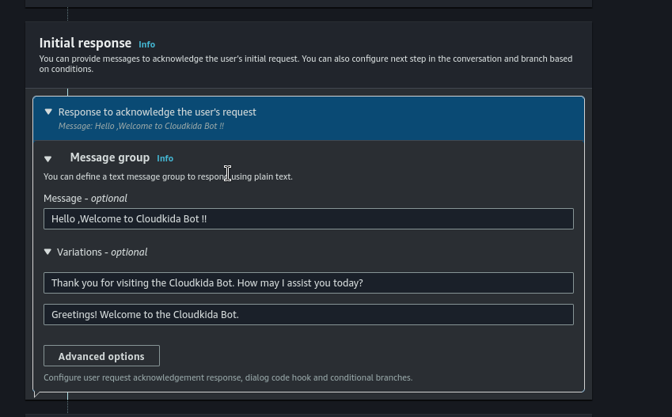

## 1.5 Build the bot

At the top right, choose **Build**. Wait for the build to finish (the status
banner shows when it succeeds). The conversation flow reflects your configured
initial response.

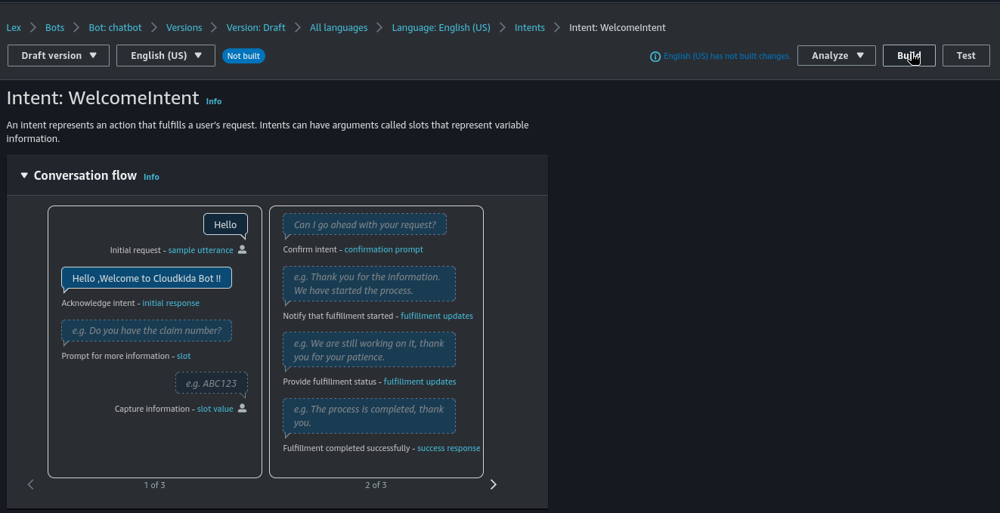

## 1.6 Test the bot

Once built, choose **Test** to open the test window. Type a greeting and confirm
the bot responds with your configured messages:

- Type `Hello` → bot replies with a greeting variation
- Type `hello` → bot replies `Hello, Welcome to Cloudkida Bot !!`

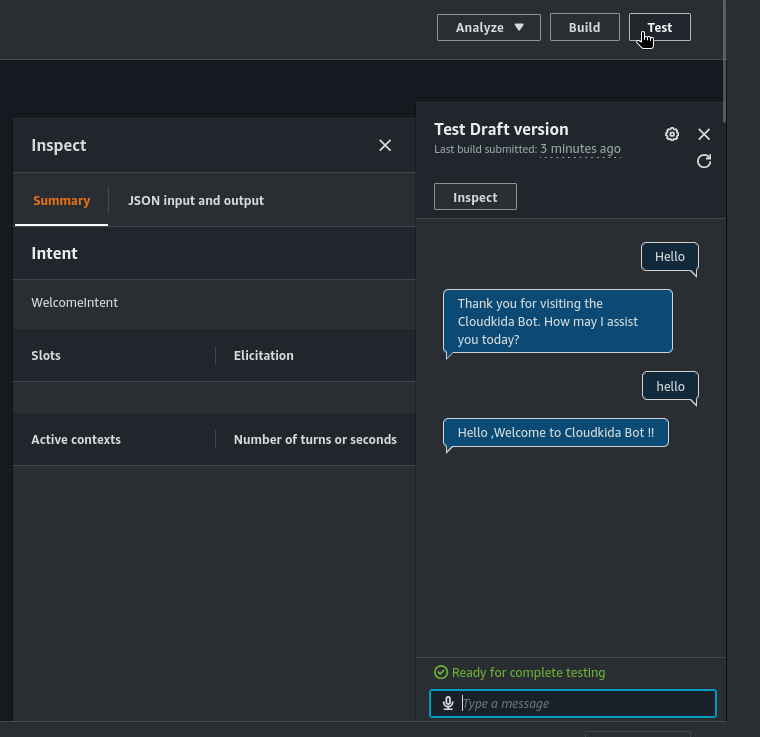

**Part 1 complete** — you have a working Lex bot that greets users.

---

# Part 2 — Upload Documents to S3 and Create the Knowledge Base

In this part you create an S3 bucket, upload your PDF documents, then create a
**VECTOR** Bedrock Knowledge Base that indexes them.

## 2.1 Create an S3 bucket

Open the S3 console → **Create bucket**.

1. **AWS Region:** US East (N. Virginia) us-east-1
2. **Bucket type:** General purpose
3. **Bucket name:** enter a globally unique name (example: `pushkardb2`)
4. Leave the other settings at their defaults.

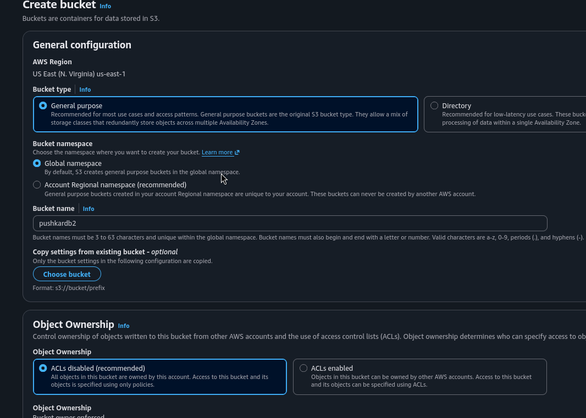

5. Scroll to the bottom and choose **Create bucket**.

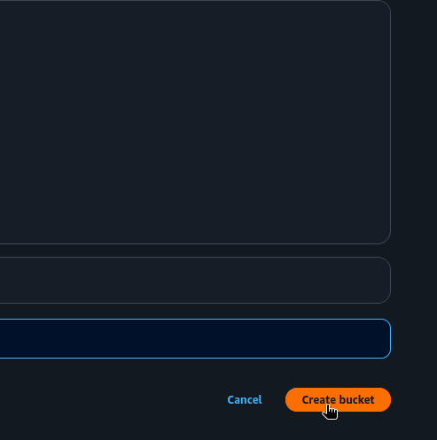

## 2.2 Upload the PDF files

1. Open the bucket you just created. It has no objects yet.
2. Choose **Upload** (top-right or the button in the empty state).

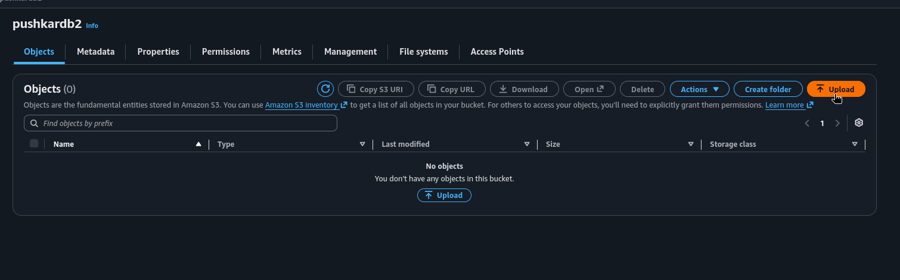

3. On the Upload page choose **Add files**.

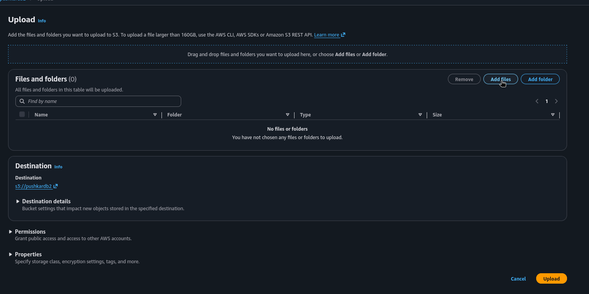

4. Select your PDF documents (example: `aws_bill.pdf`, `AWS_Services_Simple.pdf`).
5. Choose **Upload** in the bottom-right corner.

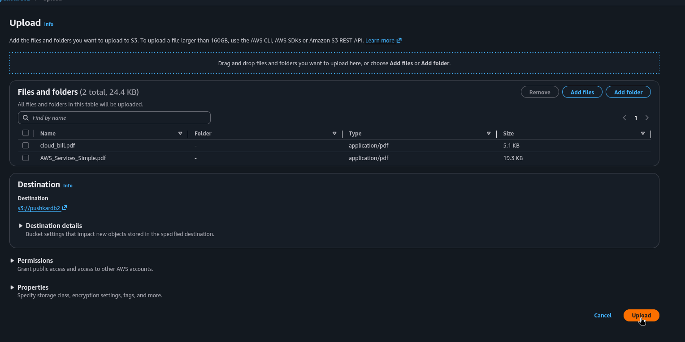

The objects now appear in the bucket.

## 2.3 Create the Knowledge Base

Open the Bedrock Knowledge Bases console:

<https://us-east-1.console.aws.amazon.com/bedrock/home?region=us-east-1#/knowledge-bases>

1. Choose **Create** and select **Unstructured Vector Store KB** (self-managed).
   > This is important — the **Vector Store** KB is the type that works with
   > Amazon Lex. Do **not** choose the Managed KB.

**Step 1 — Provide Knowledge Base details**

2. **KB name:** `CloudkidaKB`
3. **IAM permissions:** **Create and use a new service role** (default).
4. **Data source type:** **Amazon S3**.
5. Choose **Next**.

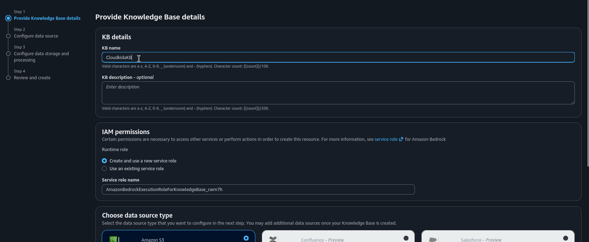

**Step 2 — Configure data source**

6. Under **S3 URI**, choose **Browse S3** and select your bucket.
7. **Parsing strategy:** choose **Amazon Bedrock Data Automation as parser**
   (best for PDFs — parses text, images, and figures).
8. Choose **Next**.

**Step 3 — Configure data storage and processing**

9. **Embedding model:** choose **Titan Embeddings G1 - Text v1.2**
   (Amazon → Titan Embeddings G1 - Text).
10. **Vector store:** choose **S3** (Quick create).
11. Choose **Next**.

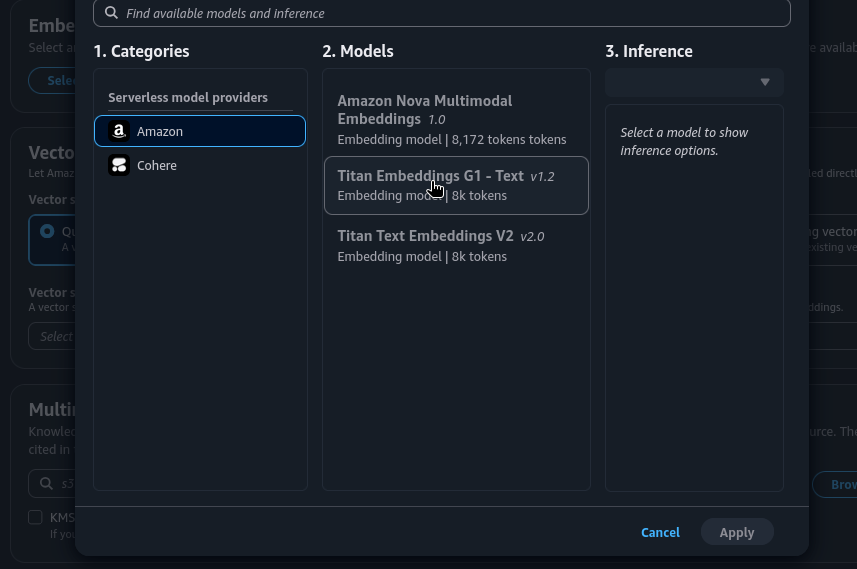

**Step 4 — Review and create**

12. Review the configuration and create the Knowledge Base.

## 2.4 Sync the data source

Once the KB is created (Status: **Available**), open it and note the
**Knowledge Base ID** (you will need it in Part 3).

Select the data source and choose **Sync**.

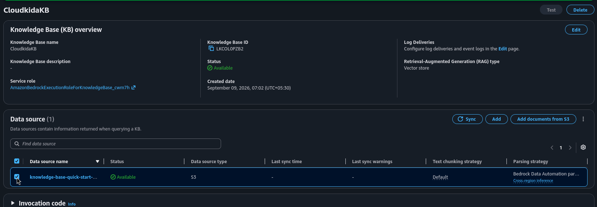

The sync reads the PDFs from S3, chunks and embeds them, and stores the vectors.
This usually takes **2–3 minutes** (longer for large data).

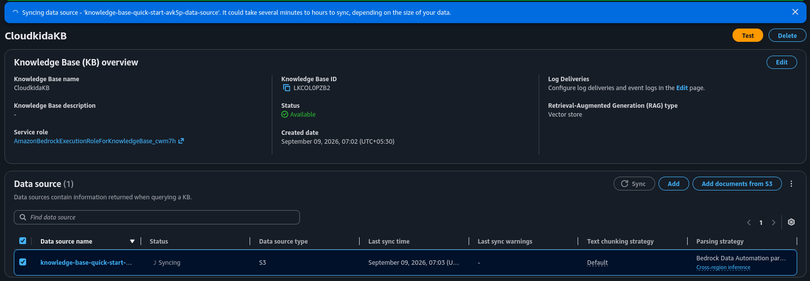

**Part 2 complete** — you have a VECTOR Knowledge Base populated with your
documents, ready to connect to Lex.

---

# Part 3 — Add the QnAIntent and Connect the Knowledge Base

In this part you add the built-in **AMAZON.QnAIntent** to the Lex bot and point
it at the Knowledge Base you created in Part 2. This is what lets the bot answer
free-form questions from your documents.

## 3.1 Open the bot's intents

Open the Lex console and go to your bot's **Intents** list (replace the bot ID
with your own):

<https://us-east-1.console.aws.amazon.com/lexv2/home?region=us-east-1#bot/M3UVYEB14Z/locale/en_US/intents>

## 3.2 Add the built-in QnA intent

1. Choose **Add intent → Use built-in intent**.

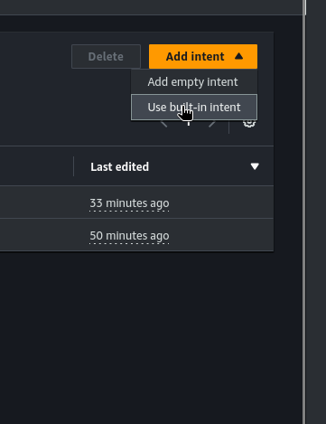

2. **Built-in intent:** select **AMAZON.QnAIntent - GenAI feature**.
3. **Intent name:** enter `QandA`.
4. Choose **Add**.

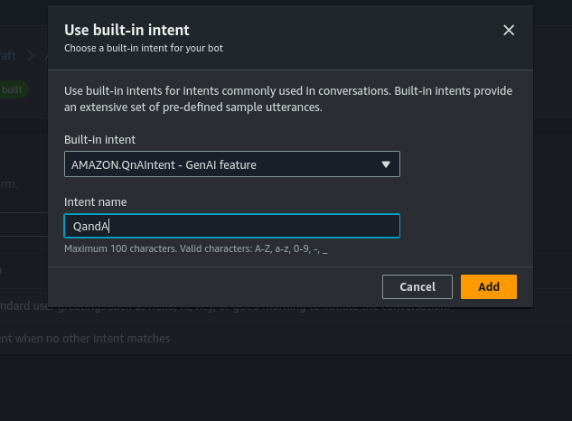

## 3.3 Copy the Knowledge Base ID

You need the KB ID from Part 2. In the Bedrock Knowledge Bases console open your
KB (`CloudkidaKB`) and copy the **Knowledge Base ID** (example: `LKCOL0PZB2`).

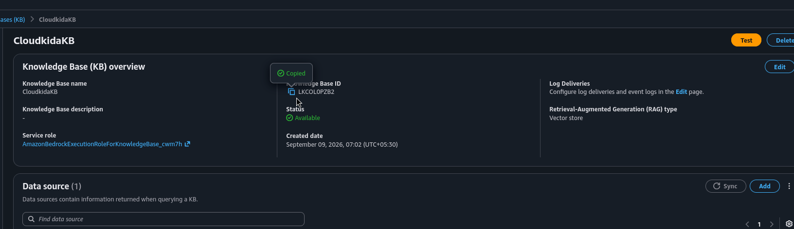

## 3.4 Configure the QnA intent

Back in the QandA intent, scroll to **QnA configuration**:

1. **Select model:** choose **Amazon → Nova Pro**.
2. **Choose a knowledge store:** select **Knowledge base for Amazon Bedrock**.
3. **Knowledge base for Amazon Bedrock Id:** paste your KB ID (`LKCOL0PZB2`).
4. Choose **Save intent**.

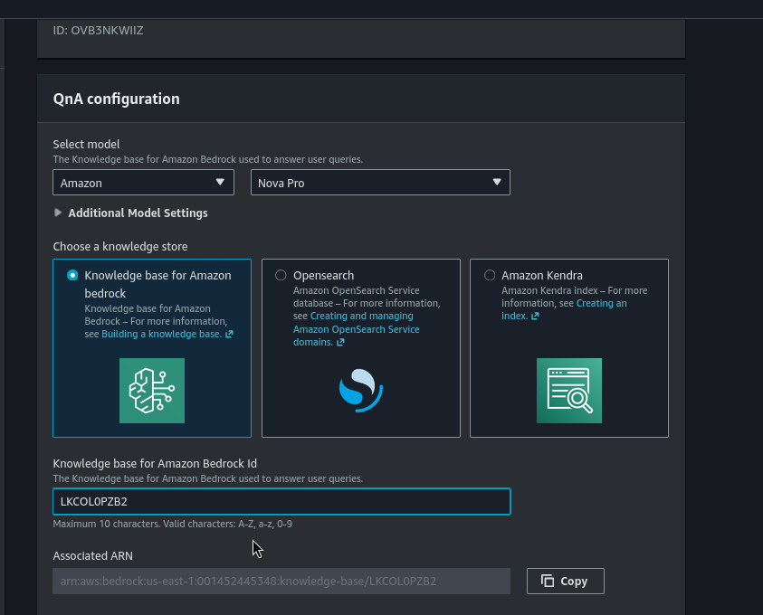

## 3.5 Grant the Lex role access to the Knowledge Base

Add an inline policy to the Lex runtime role so it can query the Knowledge Base.

1. Go to the bot's **Version: DRAFT** page. Under **IAM permissions runtime
   role**, click the role link (`AmazonLexServiceRole-...`) — open it in a new tab.

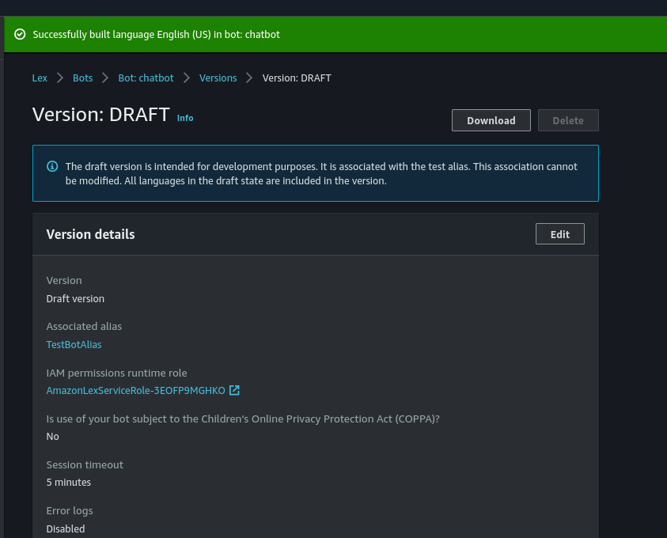

2. On the role's **Permissions** tab, choose **Add permissions → Create inline
   policy**.

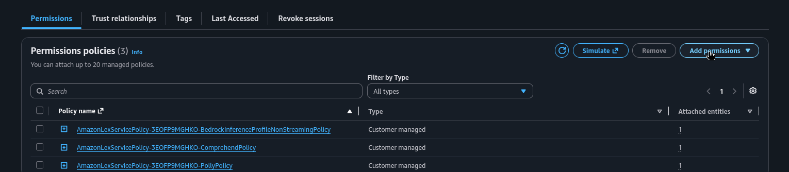

3. Switch to the **JSON** editor and paste the policy below.
   **Replace the account ID and Knowledge Base ID with your own** (the KB ID is
   the one you copied in step 3.3):

   ```json
   {
     "Version": "2012-10-17",
     "Statement": [
       {
         "Effect": "Allow",
         "Action": [
           "bedrock:Retrieve",
           "bedrock:RetrieveAndGenerate"
         ],
         "Resource": "arn:aws:bedrock:us-east-1:001452445348:knowledge-base/LKCOL0PZB2"
       }
     ]
   }
   ```

4. Give the policy a name (for example, `rag`) and choose **Create policy** /
   **Save**.

> **Alternative (quick, less strict):** instead of the inline policy above, you
> can attach the AWS-managed **`AmazonBedrockFullAccess`** policy to the role.
> This also works but grants much broader access. The scoped inline policy is
> recommended.

## 3.6 Build the bot

Return to the bot and choose **Build** at the top right. Wait for the build to
succeed.

## 3.7 Test with Inspect

Go to the **Bots** page and choose **Test**. When the test window opens, choose
**Inspect** to see intent details alongside the conversation.

Ask a question that your PDFs answer (for example, `what is my ec2 cost?`).
The bot responds using the Knowledge Base.

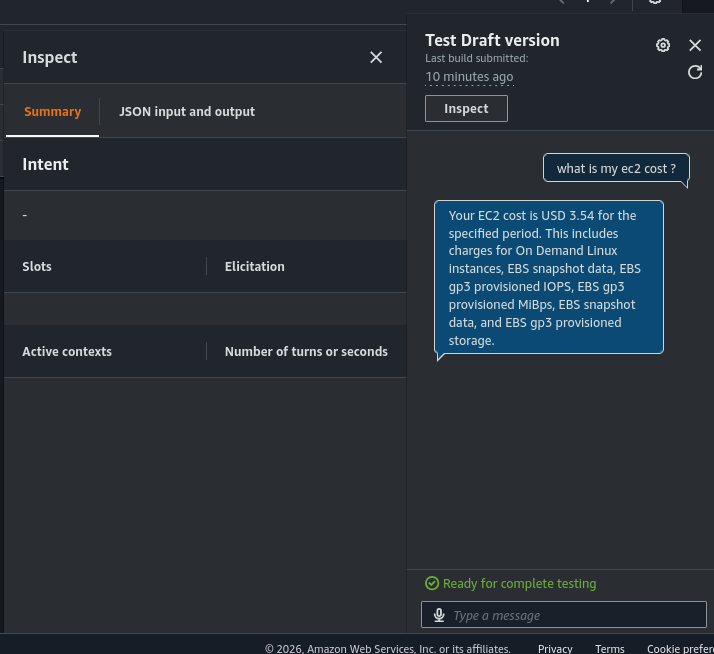

**Part 3 complete** — the Lex bot is connected to the Knowledge Base, has the
required IAM permission, and answers questions from your documents.

---

# Part 4 — Deploy the Chat UI (CloudFormation)

In this part you deploy `master-minimal.yaml`. It provisions the front end for
the bot: an EC2 instance that serves a custom chat page and calls Lex using its
instance IAM role (no Cognito). The template file is included in this repo.

## 4.1 Pre-check: default VPC and subnets

The template launches the EC2 instance into the account's **default VPC**. If
the default VPC is missing (some accounts have it deleted) or has no subnets,
the stack will fail. Verify it exists before deploying.

Run these commands (AWS CLI, region `us-east-1`):

```bash
# 1. Confirm a default VPC exists — should print a vpc-xxxx ID (not "None")
aws ec2 describe-vpcs \
  --filters "Name=isDefault,Values=true" \
  --query "Vpcs[0].VpcId" --output text --region us-east-1

# 2. Confirm the default VPC has at least one subnet — should print one or more subnet IDs
DEFAULT_VPC=$(aws ec2 describe-vpcs --filters "Name=isDefault,Values=true" \
  --query "Vpcs[0].VpcId" --output text --region us-east-1)
aws ec2 describe-subnets \
  --filters "Name=vpc-id,Values=$DEFAULT_VPC" \
  --query "Subnets[].SubnetId" --output text --region us-east-1
```

- If command 1 prints `None`, there is **no default VPC**. Create one from the
  VPC console (**Actions → Create default VPC**) or via
  `aws ec2 create-default-vpc --region us-east-1`, then re-check.
- If command 2 prints nothing, the default VPC has **no subnets** — create a
  default subnet, or use an account/region that has them.

Once both commands return values, continue.

## 4.2 Find your bot ID and alias ID

You need two values from Lex.

- **Bot ID:** Lex console → **Bots → chatbot**. Copy the **ID**
  (example: `M3UVYEB14Z`).

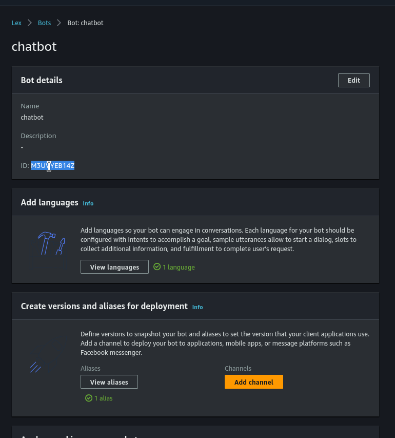

- **Bot alias ID:** open the bot → **View aliases → TestBotAlias**. Copy the
  **ID** (example: `TSTALIASID`).

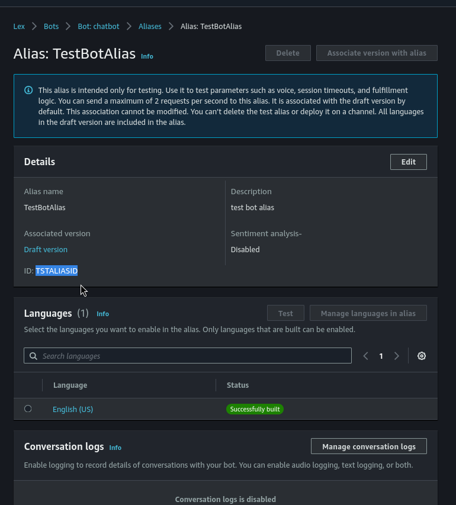

## 4.3 Create the CloudFormation stack

Open the CloudFormation console:

<https://us-east-1.console.aws.amazon.com/cloudformation/home?region=us-east-1>

1. Choose **Create stack → With new resources**.
2. **Prepare template:** Choose an existing template.
3. **Template source:** **Upload a template file** → **Choose file** → select
   `master-minimal.yaml`.
4. Choose **Next**.

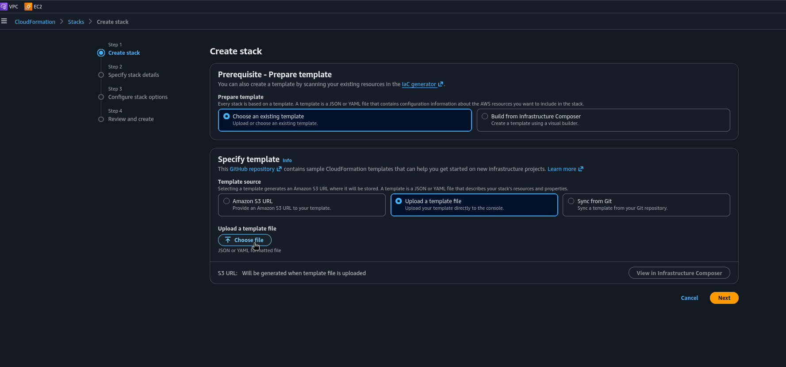

## 4.4 Specify stack details

1. **Stack name:** enter a name (for example, `chatbot`).
2. **LexV2BotId:** paste your bot ID.
3. **LexV2BotAliasId:** paste your bot alias ID.
4. Choose **Next**.

## 4.5 Configure options and acknowledge IAM

1. Leave the options at their defaults and scroll to **Capabilities**.
2. Check **I acknowledge that AWS CloudFormation might create IAM resources**.
3. Choose **Next**, then **Submit**.

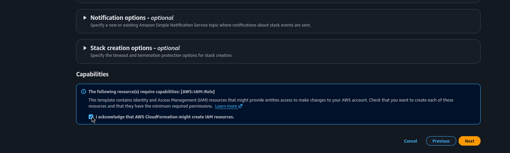

## 4.6 Wait for deployment

The template deploys the front-end resources (EC2 instance, IAM role, security
group, Elastic IP). You can watch progress in the **Events** / timeline view.
Wait until the stack status is **CREATE_COMPLETE**.

## 4.7 Open the chatbot

1. Go to the **Outputs** tab.
2. Open **PublicDnsUrl** (or **WebsiteUrl**) in a new tab.
   > Wait ~2–3 minutes after create for the instance's user data to finish
   > installing before the page loads.

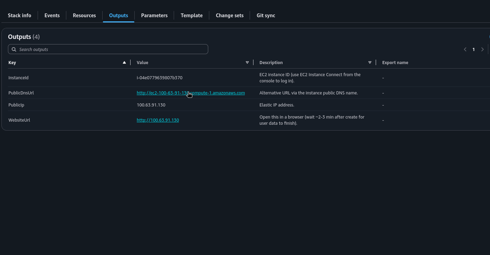

Your CloudKida chatbot is now live. Ask a question (for example, `what is ec2?`)
and it answers from your Knowledge Base.

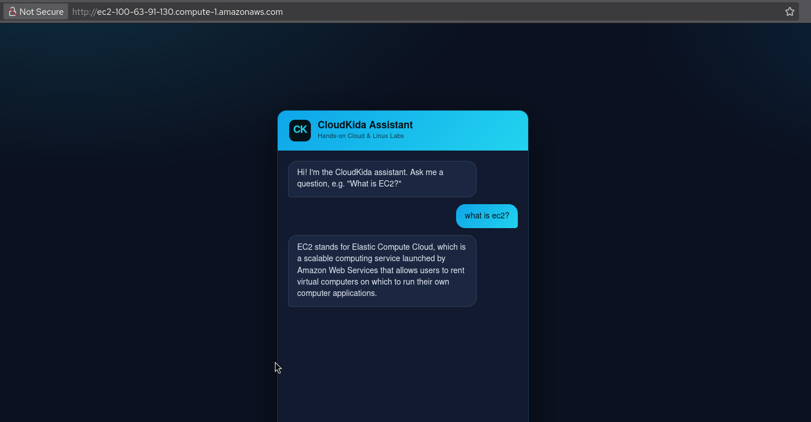

**Part 4 complete** — the chatbot is deployed and accessible from a browser.

---

# Part 5 — Clean Up

Delete the resources in this order to avoid ongoing charges. Do this when you
are finished with the demo.

## 5.1 Delete the CloudFormation stack (front end)

This removes the EC2 instance, IAM role, security group, and Elastic IP created
in Part 4.

1. Open the CloudFormation console → **Stacks**.
2. Select the stack (for example, `chatbot`) → **Delete** → **Delete stack**.
3. Wait until the stack is fully deleted.

> This stack has no S3 bucket, so it deletes cleanly. Confirm the EC2 instance
> shows **terminated** and the Elastic IP is released (a released EIP incurs no
> charge).

## 5.2 Delete the Lex bot

1. Open the Lex console → **Bots**.
2. Select **chatbot** → **Action → Delete** (or **Delete** on the bot page).

## 5.3 Delete the Bedrock Knowledge Base

1. Open the Bedrock **Knowledge Bases** console.
2. Open **CloudkidaKB** → **Delete**.

> Deleting the KB also removes its managed vector store.

## 5.4 Empty and delete the S3 bucket

An S3 bucket must be empty before it can be deleted.

1. Open the S3 console → your bucket (for example, `pushkardb2`).
2. Choose **Empty** and confirm.
3. Choose **Delete** and confirm.

## 5.5 (Optional) Remove leftover IAM roles

The Lex bot and Bedrock KB each created a service role
(`AmazonLexServiceRole-...`, `AmazonBedrockExecutionRoleForKnowledgeBase_...`).
IAM roles are free, but you can delete them from the IAM console if you want a
completely clean account.

**Part 5 complete** — all project resources are removed.

---

## Files in this repo

| File | Purpose |
|------|---------|
| `master-minimal.yaml` | CloudFormation template for the EC2-hosted chat UI (Part 4) |
| `README.md` | This guide |
| `images/` | Screenshots referenced throughout the guide |
